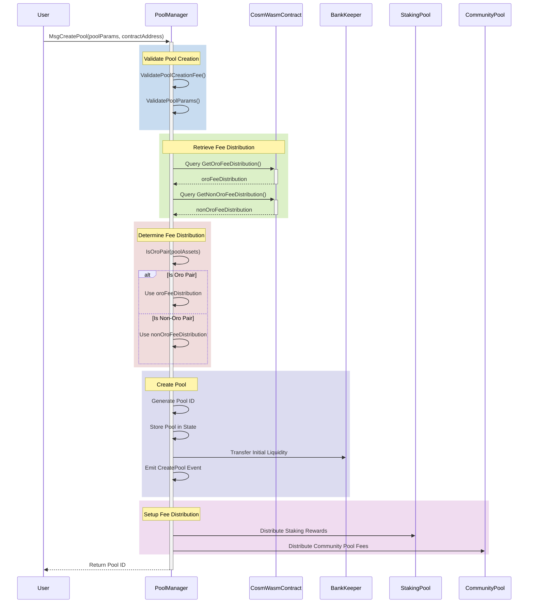

# Oro Fee Distribution via CosmWasm Smart Contract
This document explains how the Oro fee distribution system works using a CosmWasm smart contract and integrates it into the poolmanager module. The smart contract dynamically provides fee distribution values for Oro pairs and non-Oro pairs, replacing the hardcoded values in the params.go file.

### UML Sequence Diagram: Pool Creation with Fee Retrieval


## CosmWasm Smart Contract (Oro Fee Distribution)
Contract State
The contract stores fee distribution values for Oro pairs and non-Oro pairs.

```rust
#[derive(Serialize, Deserialize, Clone, Debug, PartialEq, JsonSchema)]
pub struct FeeDistribution {
    pub staking_rewards: Decimal,  // Percentage for staking rewards
    pub community_pool: Decimal,   // Percentage for the community pool
}

#[derive(Serialize, Deserialize, Clone, Debug, PartialEq, JsonSchema)]
pub struct State {
    pub oro_fee_distribution: FeeDistribution,      // Fee distribution for Oro pairs
    pub non_oro_fee_distribution: FeeDistribution,  // Fee distribution for non-Oro pairs
    pub admin: Addr,                                // Admin address for updates
}
```
## Initialization
The contract is initialized with default fee distribution values.

```rust
#[derive(Serialize, Deserialize, Clone, Debug, PartialEq, JsonSchema)]
pub struct InstantiateMsg {
    pub oro_fee_distribution: FeeDistribution,
    pub non_oro_fee_distribution: FeeDistribution,
    pub admin: String,
}

pub fn instantiate(
    deps: DepsMut,
    _env: Env,
    info: MessageInfo,
    msg: InstantiateMsg,
) -> Result<Response, ContractError> {
    // Save the initial state
    let state = State {
        oro_fee_distribution: msg.oro_fee_distribution,
        non_oro_fee_distribution: msg.non_oro_fee_distribution,
        admin: deps.api.addr_validate(&msg.admin)?,
    };
    set_contract_state(deps.storage, &state)?;
    Ok(Response::new())
}
```

## Queries
The contract allows querying fee distribution values.

```rust 
#[derive(Serialize, Deserialize, Clone, Debug, PartialEq, JsonSchema)]
pub enum QueryMsg {
    GetOroFeeDistribution {},        // Query for Oro pair fee distribution
    GetNonOroFeeDistribution {},     // Query for non-Oro pair fee distribution
}

pub fn query(deps: Deps, _env: Env, msg: QueryMsg) -> Result<Binary, ContractError> {
    match msg {
        QueryMsg::GetOroFeeDistribution {} => {
            let state = get_contract_state(deps.storage)?;
            to_binary(&state.oro_fee_distribution)  // Return Oro pair fee distribution
        }
        QueryMsg::GetNonOroFeeDistribution {} => {
            let state = get_contract_state(deps.storage)?;
            to_binary(&state.non_oro_fee_distribution)  // Return non-Oro pair fee distribution
        }
    }
}
```
## Updating Values
The admin can update fee distribution values.
```rust
#[derive(Serialize, Deserialize, Clone, Debug, PartialEq, JsonSchema)]
pub enum ExecuteMsg {
    UpdateOroFeeDistribution { staking_rewards: Decimal, community_pool: Decimal },  // Update Oro pair fee distribution
    UpdateNonOroFeeDistribution { staking_rewards: Decimal, community_pool: Decimal },  // Update non-Oro pair fee distribution
}

pub fn execute(
    deps: DepsMut,
    _env: Env,
    info: MessageInfo,
    msg: ExecuteMsg,
) -> Result<Response, ContractError> {
    let mut state = get_contract_state(deps.storage)?;
    // Ensure the caller is the admin
    if info.sender != state.admin {
        return Err(ContractError::Unauthorized {});
    }

    match msg {
        ExecuteMsg::UpdateOroFeeDistribution { staking_rewards, community_pool } => {
            // Update Oro pair fee distribution
            state.oro_fee_distribution = FeeDistribution { staking_rewards, community_pool };
        }
        ExecuteMsg::UpdateNonOroFeeDistribution { staking_rewards, community_pool } => {
            // Update non-Oro pair fee distribution
            state.non_oro_fee_distribution = FeeDistribution { staking_rewards, community_pool };
        }
    }

    // Save the updated state
    set_contract_state(deps.storage, &state)?;
    Ok(Response::new())
}
```


## 2. poolmanager Module (Oro Fee Distribution)
### Querying the Smart Contract
The poolmanager module queries the CosmWasm contract for fee distribution values.

```go
func (k Keeper) GetFeeDistribution(ctx sdk.Context) (oroFee, nonOroFee types.TakerFeeDistributionPercentage, err error) {
    // Query for Oro pair fee distribution
    queryMsg := []byte(`{"get_oro_fee_distribution": {}}`)
    oroRes, err := k.wasmKeeper.QuerySmart(ctx, contractAddress, queryMsg)
    if err != nil {
        return types.TakerFeeDistributionPercentage{}, types.TakerFeeDistributionPercentage{}, err
    }

    // Query for non-Oro pair fee distribution
    queryMsg = []byte(`{"get_non_oro_fee_distribution": {}}`)
    nonOroRes, err := k.wasmKeeper.QuerySmart(ctx, contractAddress, queryMsg)
    if err != nil {
        return types.TakerFeeDistributionPercentage{}, types.TakerFeeDistributionPercentage{}, err
    }

    // Parse the responses
    var oroFeeDistribution FeeDistribution
    if err := json.Unmarshal(oroRes, &oroFeeDistribution); err != nil {
        return types.TakerFeeDistributionPercentage{}, types.TakerFeeDistributionPercentage{}, err
    }

    var nonOroFeeDistribution FeeDistribution
    if err := json.Unmarshal(nonOroRes, &nonOroFeeDistribution); err != nil {
        return types.TakerFeeDistributionPercentage{}, types.TakerFeeDistributionPercentage{}, err
    }

    // Convert to TakerFeeDistributionPercentage
    oroFee = types.TakerFeeDistributionPercentage{
        StakingRewards: oroFeeDistribution.StakingRewards,
        CommunityPool:  oroFeeDistribution.CommunityPool,
    }

    nonOroFee = types.TakerFeeDistributionPercentage{
        StakingRewards: nonOroFeeDistribution.StakingRewards,
        CommunityPool:  nonOroFeeDistribution.CommunityPool,
    }

    return oroFee, nonOroFee, nil
}
```
### Determining Fee Distribution
The module determines which fee distribution to use based on the pool type (Oro or non-Oro).

```go
func (k Keeper) GetTakerFeeDistribution(ctx sdk.Context, isOroPair bool) types.TakerFeeDistributionPercentage {
    oroFee, nonOroFee, err := k.GetFeeDistribution(ctx)
    if err != nil {
        // Fallback to default values if the query fails
        return types.DefaultTakerFeeDistribution(isOroPair)
    }

    if isOroPair {
        return oroFee  // Use Oro pair fee distribution
    }
    return nonOroFee  // Use non-Oro pair fee distribution
}
```
## 3. Pool Creation with Fee Distribution
## Code for Pool Creation
The module creates a pool using the fee distribution values retrieved from the smart contract.
```go
func (k Keeper) CreatePool(ctx sdk.Context, msg types.MsgCreatePool) (uint64, error) {
    // Validate pool creation fee
    if err := k.ValidatePoolCreationFee(ctx, msg.Sender); err != nil {
        return 0, err
    }

    // Check if the pool is an Oro pair
    isOroPair := k.IsOroPair(msg.PoolAssets)

    // Retrieve fee distribution values from the smart contract
    feeDistribution := k.GetTakerFeeDistribution(ctx, isOroPair)

    // Create the pool
    poolId := k.GetNextPoolId(ctx)
    pool := types.NewPool(poolId, msg.PoolAssets, feeDistribution)

    // Store the pool in the state
    k.SetPool(ctx, pool)

    // Emit an event for pool creation
    ctx.EventManager().EmitEvent(
        sdk.NewEvent(
            types.EventTypeCreatePool,
            sdk.NewAttribute(types.AttributeKeyPoolId, strconv.FormatUint(poolId, 10)),
        ),
    )

    return poolId, nil
}
```
 
