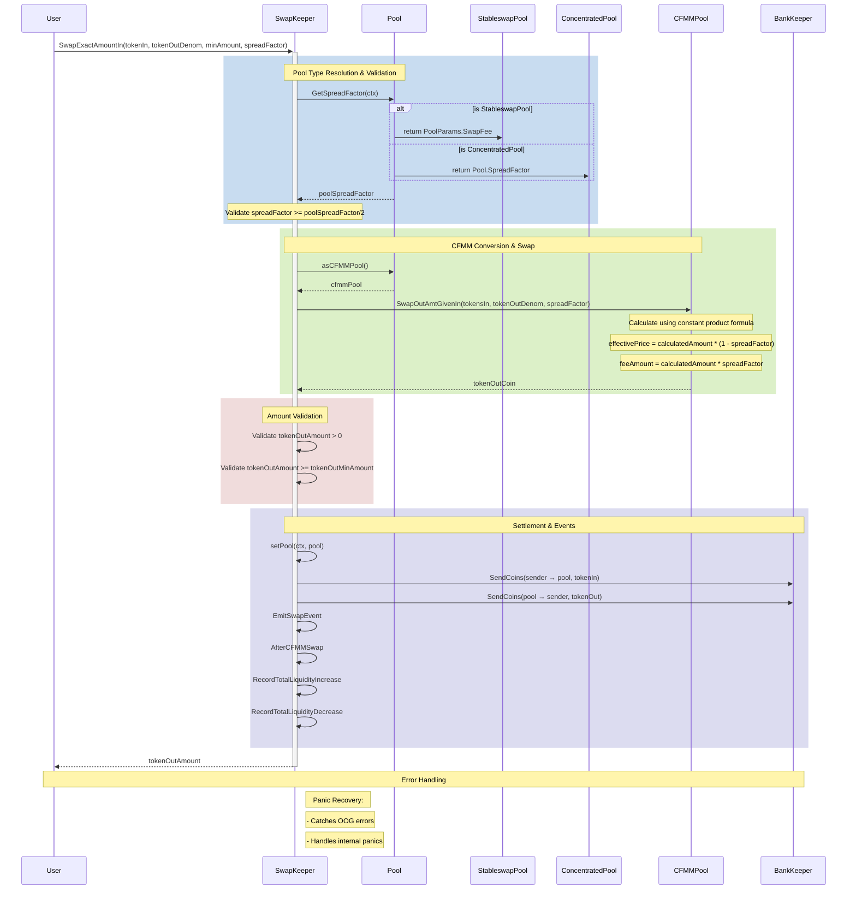
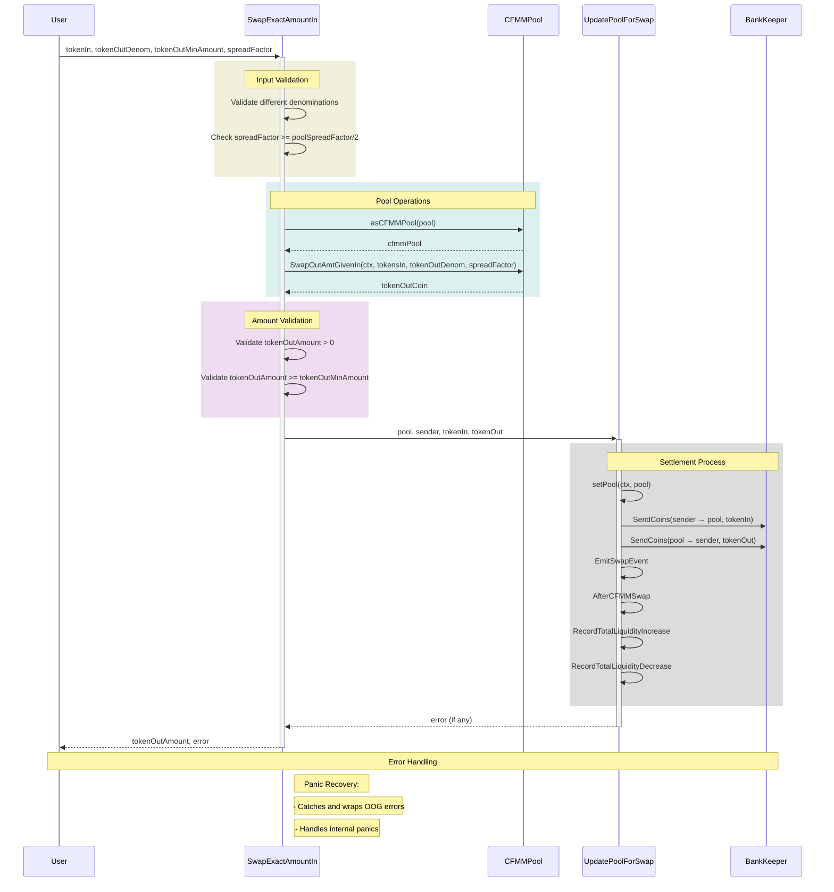
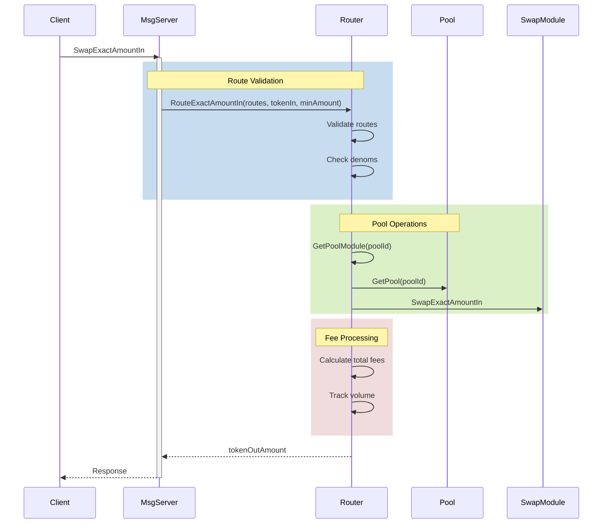
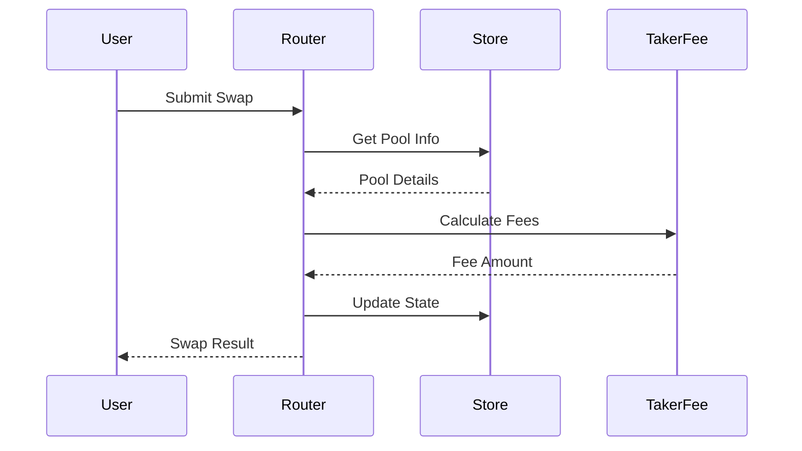
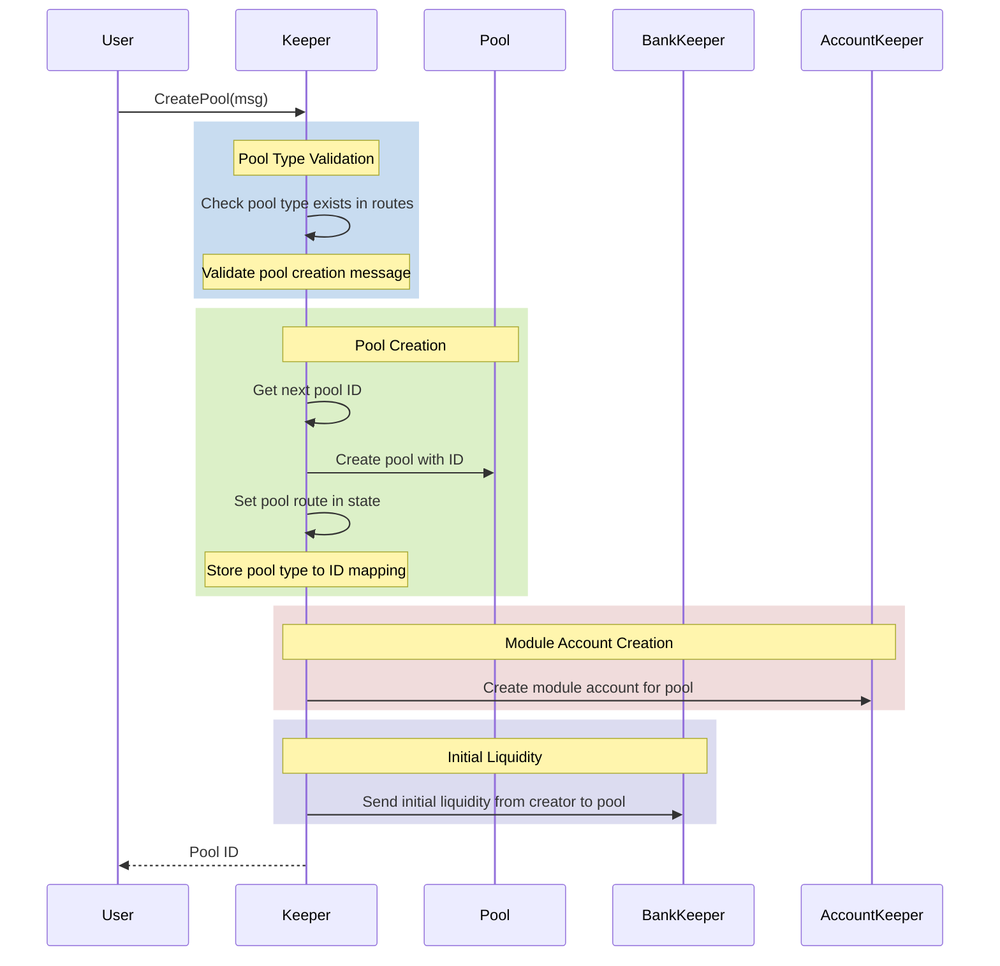
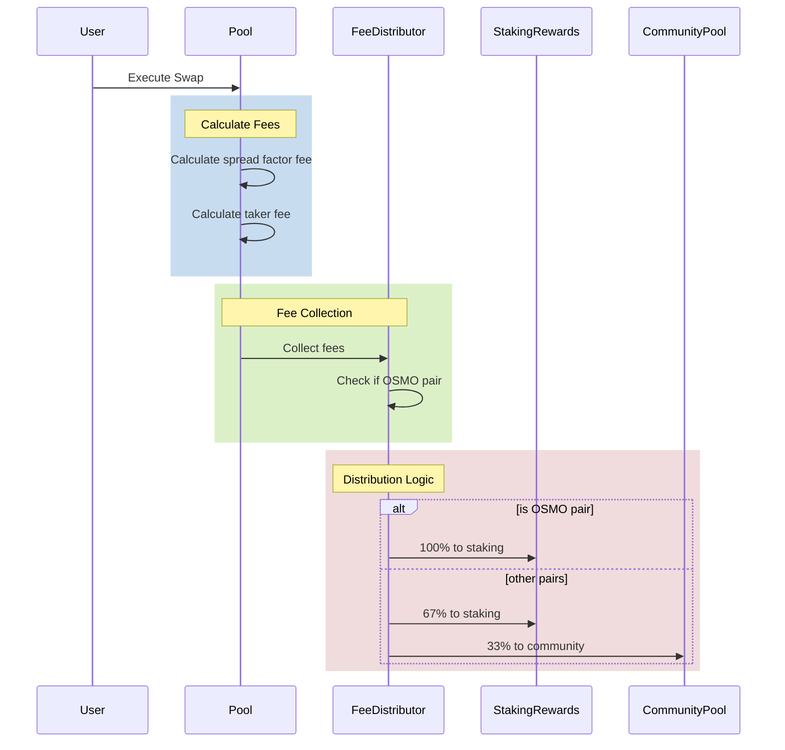
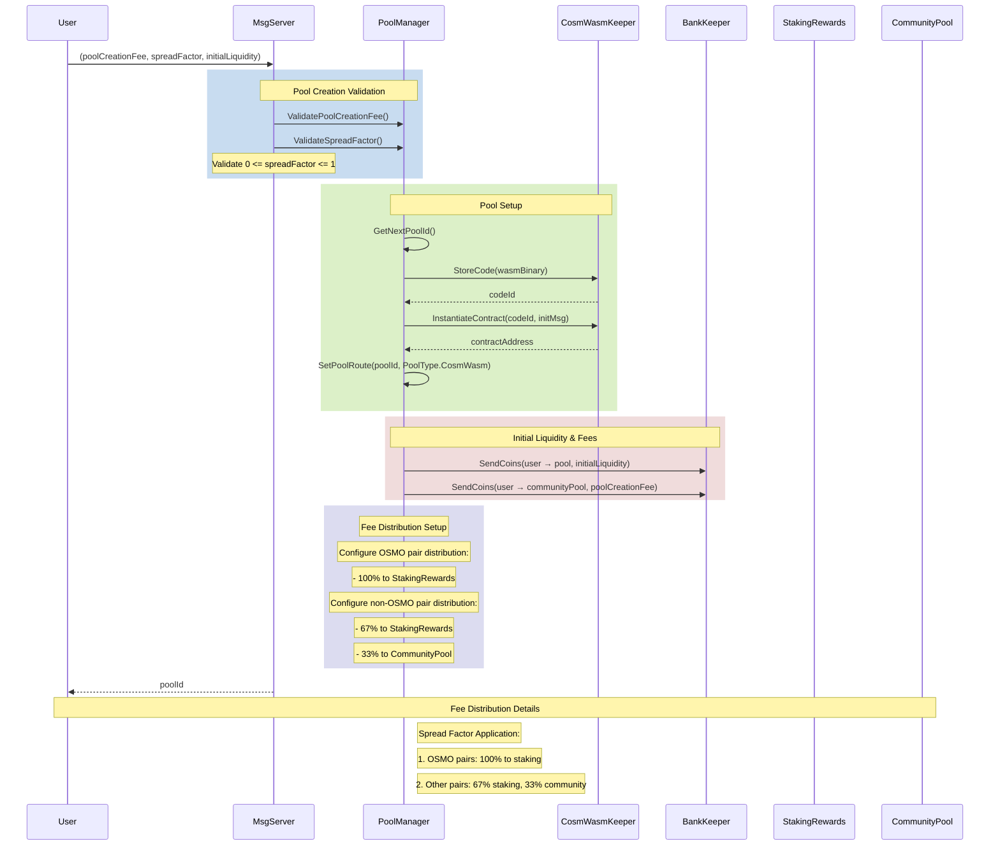

# Swap Commission UML Schema



## Key Components:

1. **Pool Type & Spread Factor Resolution**
   - Supports multiple pool types (Stableswap, Concentrated Liquidity)
   - Each pool type implements GetSpreadFactor differently
   - Validates spread factor against pool's minimum requirements

2. **CFMM Operations**
   - Converts pool to CFMM interface
   - Calculates swap amounts using constant product formula
   - Applies spread factor for fee calculation

3. **Validation & Safety**
   - Ensures positive output amounts
   - Validates minimum output requirements
   - Prevents same denomination swaps
   - Handles panic recovery

4. **Settlement Process**
   - Updates pool state
   - Executes token transfers
   - Emits events
   - Updates liquidity metrics

## Key Components:

1. **Spread Factor Validation**
   - Pool has a base spread factor
   - Swap spread factor must be ≥ pool spread factor / 2
   - Acts as a commission/fee parameter

2. **CFMM (Constant Function Market Maker)**
   - Handles actual swap calculations
   - Maintains constant product formula
   - Applies spread factor to determine final output

3. **Settlement Process**
   - Updates pool balances
   - Transfers tokens between user and pool
   - Records liquidity changes
   - Emits events

## Code Implementation Details

### 1. Spread Factor Validation
```go
// From swap.go
poolSpreadFactor := pool.GetSpreadFactor(ctx)
if spreadFactor.LT(poolSpreadFactor.QuoInt64(2)) {
    return osmomath.Int{}, fmt.Errorf("given spread factor (%s) must be greater than or equal to half of the pool's spread factor (%s)", 
        spreadFactor, poolSpreadFactor)
}
```

### 2. CFMM Pool Operations
```go
// Convert to CFMM Pool
cfmmPool, err := asCFMMPool(pool)
if err != nil {
    return osmomath.Int{}, err
}

// Execute swap calculation
tokenOutCoin, err := cfmmPool.SwapOutAmtGivenIn(ctx, tokensIn, tokenOutDenom, spreadFactor)
if err != nil {
    return osmomath.Int{}, err
}
```

### 3. Amount Validation
```go
// Validate output amount
if !tokenOutAmount.IsPositive() {
    return osmomath.Int{}, errorsmod.Wrapf(types.ErrInvalidMathApprox, "token amount must be positive")
}

if tokenOutAmount.LT(tokenOutMinAmount) {
    return osmomath.Int{}, errorsmod.Wrapf(types.ErrLimitMinAmount, "%s token is lesser than min amount", tokenOutDenom)
}
```

### 4. Settlement Process
```go
// Handle token transfers and pool updates
err = k.bankKeeper.SendCoins(ctx, sender, pool.GetAddress(), sdk.Coins{tokenIn})
if err != nil {
    return err
}

err = k.bankKeeper.SendCoins(ctx, pool.GetAddress(), sender, sdk.Coins{tokenOut})
if err != nil {
    return err
}

// Emit events and update metrics
events.EmitSwapEvent(ctx, sender, pool.GetId(), tokensIn, tokensOut)
k.hooks.AfterCFMMSwap(ctx, sender, pool.GetId(), tokensIn, tokensOut)
k.RecordTotalLiquidityIncrease(ctx, tokensIn)
k.RecordTotalLiquidityDecrease(ctx, tokensOut)
```

### Key Calculations:
1. **Spread Factor (Fee) Calculation**:
   - Minimum allowed spread factor = Pool's spread factor / 2
   - Effective Output = Calculated Output * (1 - spreadFactor)
   - Fee Amount = Calculated Output * spreadFactor

2. **CFMM (Constant Function Market Maker) Properties**:
   - Maintains constant product formula: x * y = k
   - Pool balances are updated after each swap
   - Spread factor is applied to the calculated output amount

3. **Safety Checks**:
   - Validates input and output denominations are different
   - Ensures output amount is positive
   - Verifies minimum output amount requirements
   - Checks pool liquidity sufficiency

### 5. Spread Factor Configuration

#### Setting Spread Factor
The spread factor (commission fee) is configured in multiple places:

1. **Pool Creation**:
```go
// When creating a pool, the initial spread factor is set
func NewBalancerPool(
    poolId uint64,
    poolParams balancer.PoolParams, // Contains SpreadFactor
    poolAssets []balancer.PoolAsset,
    blockTime time.Time,
) (Pool, error) {
    // spread_factor validation: 0 <= spread_factor <= 1
    if poolParams.SpreadFactor.IsNegative() || poolParams.SpreadFactor.GTE(one) {
        return Pool{}, fmt.Errorf("spread_factor must be between 0 and 1")
    }
}
```

2. **Swap Execution**:
```go
// During swap execution, spread factor is passed as parameter
func (k Keeper) SwapExactAmountIn(
    ctx sdk.Context,
    sender sdk.AccAddress,
    pool poolmanagertypes.PoolI,
    tokenIn sdk.Coin,
    tokenOutDenom string,
    tokenOutMinAmount osmomath.Int,
    spreadFactor osmomath.Dec,  // Passed during swap execution
)
```

#### Spread Factor Validation Rules:
1. Must be between 0 and 1 (0% to 100%)
2. During swaps, provided spread factor must be ≥ pool's spread factor / 2
3. Typical values range from 0.001 (0.1%) to 0.01 (1%)

#### Example Configuration:
```go
// Common spread factor values
standardSpreadFactor := osmomath.NewDecWithPrec(3, 3)  // 0.3%
lowSpreadFactor := osmomath.NewDecWithPrec(1, 3)      // 0.1%
highSpreadFactor := osmomath.NewDecWithPrec(10, 3)    // 1.0%
```

The spread factor directly impacts:
- Trading costs for users
- Revenue generation for liquidity providers
- Pool's competitiveness in the market

### 6. Spread Factor Context and Management

#### Spread Factor Storage and Access
The spread factor is managed through the Context system and is accessed via the `GetSpreadFactor` interface method:

```go
// Interface method in poolmanager/types/pool.go
GetSpreadFactor(ctx sdk.Context) osmomath.Dec
```

#### Spread Factor Lifecycle

1. **Initial Setting**:
   - Set during pool creation in genesis or pool creation transactions
   - Stored in pool-specific state
   - Must be between 0 and 1 (0% to 100%)

2. **Access Pattern**:
   - Retrieved through pool interface using Context
   - Context provides access to:
     - State store (ms MultiStore)
     - Transaction info (txBytes)
     - Gas management (gasMeter)
     - Event emission (eventManager)

3. **Validation Flow**:
```go
// During swap operations:
poolSpreadFactor := pool.GetSpreadFactor(ctx)
if spreadFactor.LT(poolSpreadFactor.QuoInt64(2)) {
    return osmomath.Int{}, fmt.Errorf(
        "given spread factor (%s) must be greater than or equal to half of the pool's spread factor (%s)", 
        spreadFactor, 
        poolSpreadFactor,
    )
}
```

4. **Key Implementation Points**:
   - Spread factor is immutable after pool creation
   - Validated on every swap operation
   - Used in CFMM calculations for:
     - SwapExactAmountIn
     - SwapExactAmountOut
     - CalcOutAmtGivenIn
     - CalcInAmtGivenOut

5. **Context Usage**:
   - The Context struct provides necessary infrastructure for:
     - State access and modification
     - Event emission for spread factor usage
     - Gas accounting for operations
     - Transaction validation

6. **Typical Values and Constraints**:
   - Default pool spread factor: 0.003 (0.3%)
   - Minimum swap spread factor: poolSpreadFactor/2
   - Maximum spread factor: 1.0 (100%)
   - Common range: 0.1% to 1%

### 7. Spread Factor Implementation Details

#### Pool-Specific Implementations

1. **Stableswap Pools**
```go
// In x/gamm/pool-models/stableswap/pool.go
func (p Pool) GetSpreadFactor(ctx sdk.Context) osmomath.Dec {
    return p.PoolParams.SwapFee
}

// Definition in stableswap_pool.pb.go
type PoolParams struct {
    SwapFee cosmossdk_io_math.LegacyDec `json:"swap_fee" yaml:"swap_fee"`
}
```

2. **Concentrated Liquidity Pools**
```go
// In x/concentrated-liquidity/model/pool.go
func (p Pool) GetSpreadFactor(ctx sdk.Context) osmomath.Dec {
    return p.SpreadFactor
}

// Definition in pool.pb.go
type Pool struct {
    SpreadFactor cosmossdk_io_math.LegacyDec `json:"spread_factor" yaml:"spread_factor"`
}
```

#### Spread Factor Setting Points

1. **Pool Creation**
   - For Stableswap: Set via `SwapFee` in pool parameters during pool creation
   - For Concentrated Liquidity: Set via `SpreadFactor` in pool initialization

2. **Genesis State**
   - Defined in genesis state for existing pools
   - Cannot be modified after pool creation

3. **Value Constraints**
   - Must be non-negative: `spreadFactor >= 0`
   - Must be less than 1: `spreadFactor < 1`
   - Typical values: 0.001 (0.1%) to 0.01 (1%)

4. **Usage in Swap Operations**
   ```go
   // Validation during swap
   poolSpreadFactor := pool.GetSpreadFactor(ctx)
   if spreadFactor.LT(poolSpreadFactor.QuoInt64(2)) {
       return osmomath.Int{}, fmt.Errorf(
           "given spread factor (%s) must be greater than or equal to half of the pool's spread factor (%s)", 
           spreadFactor, 
           poolSpreadFactor,
       )
   }
   ```

#### Implementation Notes

1. **Naming Convention**
   - Stableswap pools use `SwapFee`
   - Concentrated Liquidity pools use `SpreadFactor`
   - Both represent the same concept: trading fee percentage

2. **Storage**
   - Stored as `LegacyDec` type from Cosmos SDK
   - Allows for precise decimal calculations
   - Persisted in pool state

3. **Access Pattern**
   - Read-only after pool creation
   - Accessed through `GetSpreadFactor` interface method
   - Used in all swap calculations

4. **Fee Calculation Example**
   ```go
   effectivePrice = calculatedAmount * (1 - spreadFactor)
   feeAmount = calculatedAmount * spreadFactor
   ```

## Code Implementation Flow



The diagram above illustrates the detailed code flow from the implementation, showing:
1. Method calls and their parameters
2. Error handling and validation steps
3. Pool operations and state updates
4. Settlement process and event emission
5. Panic recovery and error wrapping

### 8. Pool Manager and Router Interaction

The pool manager and router work together to handle swap requests and route them through appropriate pools:



#### Key Components:

1. **Message Server (msg_server.go)**
   - Entry point for all swap-related messages
   - Validates basic message parameters
   - Delegates actual swap execution to Router
   - Handles response back to client

2. **Router (router.go)**
   ```go
   // Routes swaps through pools based on provided routes
   func (k Keeper) RouteExactAmountIn(
       ctx sdk.Context,
       sender sdk.AccAddress,
       route []types.SwapAmountInRoute,
       tokenIn sdk.Coin,
       tokenOutMinAmount osmomath.Int,
   ) (tokenOutAmount osmomath.Int, err error)
   ```

3. **Routing Process**
   - Validates route is not empty
   - Ensures proper denom formats
   - Gets appropriate pool module for each hop
   - Executes swaps through each pool
   - Tracks fees and volume

4. **Multi-Hop Execution**
   ```go
   // For each step in route:
   for i, routeStep := range route {
       // Get pool and module
       swapModule, pool, err := k.GetPoolModuleAndPool(ctx, routeStep.PoolId)
       
       // Execute swap
       tokenOutAmount, err = swapModule.SwapExactAmountIn(
           ctx, sender, pool, tokenIn, 
           routeStep.TokenOutDenom, _outMinAmount, 
           pool.GetSpreadFactor(ctx),
       )
   }
   ```

5. **Fee Handling**
   - Each pool in route can have different spread factors
   - Fees are collected at each hop
   - Total fees are tracked for the entire route

#### Implementation Details:

1. **Route Validation**
   ```go
   // Ensure route is valid
   if err := types.SwapAmountInRoutes(route).Validate(); err != nil {
       return osmomath.Int{}, err
   }
   ```

2. **Pool Module Resolution**
   ```go
   // Get pool-specific module
   swapModule, err := k.GetPoolModule(ctx, poolId)
   if err != nil {
       return
   }
   ```

3. **Swap Execution**
   ```go
   // Execute swap through pool
   tokenOutAmount, err = swapModule.SwapExactAmountIn(
       ctx, sender, pool, tokenIn, 
       tokenOutDenom, tokenOutMinAmount, 
       spreadFactor,
   )
   ```

4. **Error Handling**
   - Validates pool exists and is active
   - Ensures sufficient liquidity
   - Checks minimum output amounts
   - Handles panic recovery

This architecture allows for:
- Multiple pool types (Balancer, Stableswap, etc.)
- Multi-hop trades through different pools
- Custom fee structures per pool
- Volume tracking and analytics

### 9. Pool Manager Core Components

#### Store (store.go)
The store.go file manages the state storage for the pool manager module:

1. **Key Functions**:
```go
// Key state management functions
func (k Keeper) GetNextPoolId(ctx sdk.Context) uint64
func (k Keeper) SetNextPoolId(ctx sdk.Context, poolId uint64)
func (k Keeper) SetPoolRoute(ctx sdk.Context, poolId uint64, poolType types.PoolType)
```

2. **State Storage**:
- Manages pool IDs and routes
- Handles pool type to module mapping
- Maintains cached pool modules for performance

#### Router (router.go)
The router.go file handles routing swaps through different pool types:

1. **Key Functions**:
```go
// Main routing functions
func (k Keeper) RouteExactAmountIn(ctx sdk.Context, sender sdk.AccAddress, route []types.SwapAmountInRoute, tokenIn sdk.Coin, tokenOutMinAmount osmomath.Int)
func (k Keeper) RouteExactAmountOut(ctx sdk.Context, sender sdk.AccAddress, route []types.SwapAmountOutRoute, tokenInMaxAmount osmomath.Int, tokenOut sdk.Coin)
```

2. **Routing Process**:
- Validates routes and denoms
- Routes through multiple pools if needed
- Handles multi-hop trades
- Manages taker fees across route

#### Taker Fee (taker_fee.go)
The taker_fee.go file manages the fee collection and distribution:

1. **Fee Structure**:
```go
// Fee calculation functions
func CalcTakerFeeExactIn(tokenIn sdk.Coin, takerFee osmomath.Dec) (tokenInAfterFee sdk.Coin, takerFeeAmount sdk.Coin)
func CalcTakerFeeExactOut(tokenIn sdk.Coin, takerFee osmomath.Dec) (tokenInAfterFee sdk.Coin, takerFeeAmount sdk.Coin)
```

2. **Fee Management**:
- Calculates taker fees for trades
- Distributes fees between staking rewards and community pool
- Handles fee tracking and accounting

#### Integration Flow:



Key Features:
1. **State Management**
   - Pool ID tracking
   - Route mapping
   - Module caching

2. **Routing Logic**
   - Multi-hop support
   - Split routes
   - Fee management

3. **Fee Handling**
   - Fee calculation
   - Distribution logic
   - State tracking

### 10. Pool Manager Parameters

The pool manager module maintains several key parameters that govern pool creation and trading behavior:

#### Parameter Structure
```go
// Key parameters that control pool behavior
var (
    KeyPoolCreationFee                                = []byte("PoolCreationFee")
    KeyDefaultTakerFee                                = []byte("DefaultTakerFee")
    KeyOsmoTakerFeeDistribution                       = []byte("OsmoTakerFeeDistribution")
    KeyNonOsmoTakerFeeDistribution                    = []byte("NonOsmoTakerFeeDistribution")
    KeyAdminAddresses                                 = []byte("AdminAddresses")
    KeyCommunityPoolDenomToSwapNonWhitelistedAssetsTo = []byte("CommunityPoolDenomToSwapNonWhitelistedAssetsTo")
    KeyAuthorizedQuoteDenoms                          = []byte("AuthorizedQuoteDenoms")
    KeyReducedTakerFeeByWhitelist                     = []byte("ReducedTakerFeeByWhitelist")
)
```

#### Default Parameters
```go
// Default parameter values
func DefaultParams() Params {
    return Params{
        PoolCreationFee: sdk.Coins{sdk.NewInt64Coin(appparams.BaseCoinUnit, 1000_000_000)}, // 1000 OSMO
        TakerFeeParams: TakerFeeParams{
            DefaultTakerFee: ZeroDec, // 0%
            OsmoTakerFeeDistribution: TakerFeeDistributionPercentage{
                StakingRewards: osmomath.MustNewDecFromStr("1"),  // 100%
                CommunityPool:  osmomath.MustNewDecFromStr("0"),  // 0%
            },
            NonOsmoTakerFeeDistribution: TakerFeeDistributionPercentage{
                StakingRewards: osmomath.MustNewDecFromStr("0.67"), // 67%
                CommunityPool:  osmomath.MustNewDecFromStr("0.33"), // 33%
            },
            AdminAddresses: []string{},
            CommunityPoolDenomToSwapNonWhitelistedAssetsTo: "USDC", // Default swap denom
            ReducedFeeWhitelist: []string{},
        },
        AuthorizedQuoteDenoms: []string{
            appparams.BaseCoinUnit, // OSMO
            "ATOM",                 // ATOM
            "DAI",                  // DAI
            "USDC",                // USDC
        },
    }
}
```

#### Key Components:

1. **Pool Creation Fee**
   - Fee required to create a new pool
   - Default: 1000 OSMO
   - Validates that fee coins are valid

2. **Taker Fee Parameters**
   - Default taker fee (trading fee)
   - Distribution of fees between staking rewards and community pool
   - Separate distribution ratios for OSMO and non-OSMO pairs
   - Whitelist for reduced fees

3. **Authorized Quote Denoms**
   - List of allowed quote denominations
   - Used for price calculations and trading pairs
   - Must contain at least one denomination

#### Parameter Validation:

1. **Pool Creation Fee**
```go
func validatePoolCreationFee(i interface{}) error {
    v, ok := i.(sdk.Coins)
    if !ok {
        return fmt.Errorf("invalid parameter type: %T", i)
    }
    if v.Validate() != nil {
        return fmt.Errorf("invalid pool creation fee: %+v", i)
    }
    return nil
}
```

2. **Taker Fee**
```go
func validateDefaultTakerFee(i interface{}) error {
    defaultTakerFee, ok := i.(osmomath.Dec)
    if !ok {
        return fmt.Errorf("invalid parameter type: %T", i)
    }
    if defaultTakerFee.IsNegative() || defaultTakerFee.GT(OneDec) {
        return fmt.Errorf("invalid default taker fee: %s", defaultTakerFee)
    }
    return nil
}
```

3. **Fee Distribution**
```go
func validateTakerFeeDistribution(i interface{}) error {
    takerFeeDistribution, ok := i.(TakerFeeDistributionPercentage)
    if !ok {
        return fmt.Errorf("invalid parameter type: %T", i)
    }
    // Validate staking rewards percentage
    if takerFeeDistribution.StakingRewards.IsNegative() || 
       takerFeeDistribution.StakingRewards.GT(OneDec) {
        return fmt.Errorf("invalid staking rewards distribution: %s", 
                         takerFeeDistribution.StakingRewards)
    }
    // Validate community pool percentage
    if takerFeeDistribution.CommunityPool.IsNegative() || 
       takerFeeDistribution.CommunityPool.GT(OneDec) {
        return fmt.Errorf("invalid community pool distribution: %s", 
                         takerFeeDistribution.CommunityPool)
    }
    return nil
}
```

These parameters are crucial for:
- Controlling pool creation costs
- Managing trading fees
- Distributing protocol revenue
- Maintaining authorized trading pairs

### 10. GAMM Module Parameters

The GAMM (Generalized Automated Market Maker) module maintains core parameters that govern pool creation and management:

#### Parameter Structure
```go
// Key parameter that controls pool creation
var KeyPoolCreationFee = []byte("PoolCreationFee")

// ParamTable for gamm module
func ParamKeyTable() paramtypes.KeyTable {
    return paramtypes.NewKeyTable().RegisterParamSet(&Params{})
}
```

#### Parameter Management

1. **Pool Creation Fee**
```go
// Default gamm module parameters
func DefaultParams() Params {
    return Params{
        PoolCreationFee: sdk.Coins{sdk.NewInt64Coin(appparams.BaseCoinUnit, 1000_000_000)}, // 1000 OSMO
    }
}
```

2. **Parameter Validation**
```go
// Validate params
func (p Params) Validate() error {
    if err := validatePoolCreationFee(p.PoolCreationFee); err != nil {
        return err
    }
    return nil
}

func validatePoolCreationFee(i interface{}) error {
    v, ok := i.(sdk.Coins)
    if !ok {
        return fmt.Errorf("invalid parameter type: %T", i)
    }

    if v.Validate() != nil {
        return fmt.Errorf("invalid pool creation fee: %+v", i)
    }
    return nil
}
```

#### Key Components:

1. **Pool Creation Fee**
   - Default: 1000 OSMO
   - Purpose: Controls barrier to entry for creating new pools
   - Validation: Must be valid Cosmos SDK coins

2. **Parameter Updates**
   - Managed through governance
   - Changes require parameter change proposals
   - Affects all new pool creation after update

3. **Integration Points**
   - Pool Creation: Fee checked and charged
   - Module Initialization: Parameters loaded from genesis
   - Governance: Parameter change proposals

This parameter system ensures:
- Consistent pool creation costs
- Governance control over module parameters
- Proper validation of all parameter changes

### 10. ProtoRev Fee Tracking System

The ProtoRev system in poolmanager handles tracking and management of taker fees for both stakers and the community pool:

#### Key Components:

1. **Taker Fee Tracking Functions**:
```go
// Gets all staker taker fees collected since accounting height
func (k Keeper) GetTakerFeeTrackerForStakers(ctx sdk.Context) []sdk.Coin

// Gets staker taker fees for specific denom
func (k Keeper) GetTakerFeeTrackerForStakersByDenom(ctx sdk.Context, denom string) (sdk.Coin, error)

// Updates staker taker fee tracker for specific denom
func (k Keeper) UpdateTakerFeeTrackerForStakersByDenom(ctx sdk.Context, denom string, increasedAmt osmomath.Int) error
```

2. **Community Pool Fee Tracking**:
```go
// Gets all community pool taker fees collected
func (k Keeper) GetTakerFeeTrackerForCommunityPool(ctx sdk.Context) []sdk.Coin

// Gets community pool taker fees for specific denom 
func (k Keeper) GetTakerFeeTrackerForCommunityPoolByDenom(ctx sdk.Context, denom string) (sdk.Coin, error)

// Updates community pool taker fee tracker for specific denom
func (k Keeper) UpdateTakerFeeTrackerForCommunityPoolByDenom(ctx sdk.Context, denom string, increasedAmt osmomath.Int) error
```

3. **Fee Tracking Height Management**:
```go
// Gets height from which taker fee tracking started
func (k Keeper) GetTakerFeeTrackerStartHeight(ctx sdk.Context) int64

// Sets height from which taker fee tracking starts
func (k Keeper) SetTakerFeeTrackerStartHeight(ctx sdk.Context, startHeight int64)
```

#### Implementation Details:

1. **Fee Storage**:
   - Fees are tracked per denom
   - Separate tracking for stakers and community pool
   - Uses prefix-based key-value store

2. **Fee Updates**:
   - Atomic updates to prevent inconsistencies
   - Validation of amounts and denoms
   - Error handling for invalid operations

3. **Legacy Support**:
   - Maintains backward compatibility
   - Handles migration from old fee tracking system
   - Provides legacy getters for upgrade handlers

4. **Integration Points**:
   - Used during swap execution
   - Integrated with governance
   - Connected to community pool distribution

### 11. Pool Manager Keeper

The Pool Manager Keeper is a central component that manages all pool-related operations and coordinates between different pool types. Here's its key structure and responsibilities:

#### Keeper Structure
```go
type Keeper struct {
    storeKey storetypes.StoreKey
    
    // Pool Module Interfaces
    gammKeeper           types.PoolModuleI
    concentratedKeeper   types.ConcentratedI
    cosmwasmpoolKeeper   types.PoolModuleI
    
    // Supporting Keepers
    poolIncentivesKeeper types.PoolIncentivesKeeperI
    bankKeeper           types.BankI
    accountKeeper        types.AccountI
    communityPoolKeeper  types.CommunityPoolI
    stakingKeeper        types.StakingKeeper
    protorevKeeper      types.ProtorevKeeper
    wasmKeeper          types.WasmKeeper

    // Pool Type Management
    routes map[types.PoolType]types.PoolModuleI
    cachedPoolModules *sync.Map
    poolModules []types.PoolModuleI
}
```

#### Key Responsibilities:

1. **Pool Type Management**
   - Maps pool types to their respective modules
   - Maintains cache of pool modules for efficient access
   - Supports multiple pool implementations (Balancer, Stableswap, Concentrated)

2. **Route Management**
   ```go
   routesMap := map[types.PoolType]types.PoolModuleI{
       types.Balancer:     gammKeeper,
       types.Stableswap:   gammKeeper,
       types.Concentrated: concentratedKeeper,
       types.CosmWasm:     cosmwasmpoolKeeper,
   }
   ```

3. **State Management**
   - Manages pool creation and initialization
   - Handles pool parameters and configuration
   - Maintains pool routes and IDs

4. **Parameter Management**
   - Handles pool creation fees
   - Manages taker fees and their distribution
   - Controls authorized quote denominations

5. **Genesis Handling**
   ```go
   // Initialization
   func (k Keeper) InitGenesis(ctx sdk.Context, genState *types.GenesisState) {
       k.SetNextPoolId(ctx, genState.NextPoolId)
       k.SetParams(ctx, genState.Params)
       // Set pool routes, taker fees, volumes
   }
   ```

6. **Volume Tracking**
   - Records pool trading volumes
   - Tracks taker fees
   - Manages liquidity metrics

7. **Cache Management**
   - Maintains cached pool modules
   - Handles taker fee agreements
   - Manages registered pool states

#### Integration Points:

1. **Pool Creation**
   - Validates pool parameters
   - Assigns pool IDs
   - Sets up initial state

2. **Swap Routing**
   - Routes swaps to appropriate pool modules
   - Handles multi-hop trades
   - Manages taker fees

3. **State Updates**
   - Updates pool liquidity
   - Records trading volumes
   - Manages fee collection

4. **Event Management**
   - Emits swap events
   - Tracks liquidity changes
   - Records fee collection events

### 12. Pool Manager Message Server

The Pool Manager Message Server (`msg_server.go`) handles all swap-related messages in the protocol. Here are its key components:

#### Message Handler Structure
```go
type msgServer struct {
    keeper *Keeper
}

// Creates new message server instance
func NewMsgServerImpl(keeper *Keeper) types.MsgServer {
    return &msgServer{keeper: keeper}
}
```

#### Key Message Handlers:

1. **SwapExactAmountIn**
```go
// Handles swaps with exact input amount
func (server msgServer) SwapExactAmountIn(
    goCtx context.Context, 
    msg *types.MsgSwapExactAmountIn,
) (*types.MsgSwapExactAmountInResponse, error) {
    ctx := sdk.UnwrapSDKContext(goCtx)
    sender, err := sdk.AccAddressFromBech32(msg.Sender)
    
    // Routes swap through pools using keeper
    tokenOutAmount, err := server.keeper.RouteExactAmountIn(
        ctx, sender, msg.Routes, msg.TokenIn, msg.TokenOutMinAmount,
    )
    
    return &types.MsgSwapExactAmountInResponse{TokenOutAmount: tokenOutAmount}, nil
}
```

2. **SwapExactAmountOut**
```go
// Handles swaps with exact output amount
func (server msgServer) SwapExactAmountOut(
    goCtx context.Context,
    msg *types.MsgSwapExactAmountOut,
) (*types.MsgSwapExactAmountOutResponse, error) {
    ctx := sdk.UnwrapSDKContext(goCtx)
    sender, err := sdk.AccAddressFromBech32(msg.Sender)
    
    // Routes swap through pools using keeper
    tokenInAmount, err := server.keeper.RouteExactAmountOut(
        ctx, sender, msg.Routes, msg.TokenInMaxAmount, msg.TokenOut,
    )
    
    return &types.MsgSwapExactAmountOutResponse{TokenInAmount: tokenInAmount}, nil
}
```

3. **Split Route Swaps**
   - `SplitRouteSwapExactAmountIn`: Handles multi-route swaps with exact input
   - `SplitRouteSwapExactAmountOut`: Handles multi-route swaps with exact output
   - Allows optimizing execution by splitting across multiple paths

4. **Taker Fee Management**
   - `SetDenomPairTakerFee`: Sets taker fees for specific token pairs
   - `SetTakerFeeShareAgreementForDenom`: Configures fee sharing agreements
   - `SetRegisteredAlloyedPool`: Registers pools for fee sharing

#### Key Implementation Points:

1. **Message Flow**
   - Receives cosmos-sdk messages
   - Validates basic parameters
   - Delegates to keeper for actual execution
   - Returns appropriate response

2. **Error Handling**
   - Address parsing validation
   - Route validation
   - Swap execution errors
   - Authorization checks

3. **Event Management**
   - Swap events handled by underlying modules
   - Fee-related events emitted directly

4. **Authorization**
   - Some operations restricted to governance
   - Fee management requires proper permissions
   - Pool registration controlled by governance

This message server acts as the entry point for all swap-related transactions, coordinating between users, the keeper, and various pool types.

### 13. Pool Creation Process



#### Key Components:

1. **Pool Creation Functions**:
   ```go
   // Main pool creation function
   func (k Keeper) CreatePool(ctx sdk.Context, msg types.CreatePoolMsg) (uint64, error)
   
   // Internal helper for zero liquidity pools
   func (k Keeper) createPoolZeroLiquidityNoCreationFee(ctx sdk.Context, msg types.CreatePoolMsg) (types.PoolI, error)
   ```

2. **Creation Process**:
   - Validates pool type exists in routes
   - Gets next pool ID from state
   - Creates pool with specific ID
   - Sets up pool route in state
   - Creates module account for pool
   - Handles initial liquidity transfer

3. **Pool Route Management**:
   ```go
   // Maps pool ID to pool type in state
   func (k *Keeper) SetPoolRoute(ctx sdk.Context, poolId uint64, poolType types.PoolType)
   
   // Retrieves pool module for given pool ID
   func (k *Keeper) GetPoolModule(ctx sdk.Context, poolId uint64) (types.PoolModuleI, error)
   ```

4. **Key Validations**:
   - Pool type must be registered
   - Pool ID must be less than max allowed
   - Pool creation parameters must be valid
   - Initial liquidity must be valid

5. **Community Pool Funding**:
   - Checks if creator is whitelisted
   - If not whitelisted, charges pool creation fee
   - Fee goes to community pool

#### Implementation Details:

1. **Pool Creation Message Validation**:
   ```go
   // Validates basic parameters
   err := msg.Validate(ctx)
   if err != nil {
       return nil, err
   }
   ```

2. **Pool ID Management**:
   ```go
   // Get and increment pool ID
   poolId := k.getNextPoolIdAndIncrement(ctx)
   if poolId >= types.MaxPoolId {
       return nil, fmt.Errorf("next pool ID exceeds max")
   }
   ```

3. **Pool Route Setting**:
   ```go
   // Store pool type mapping
   k.SetPoolRoute(ctx, poolId, poolType)
   ```

4. **Module Account Creation**:
   ```go
   // Create pool's module account
   if err := osmoutils.CreateModuleAccount(ctx, k.accountKeeper, pool.GetAddress()); err != nil {
       return nil, fmt.Errorf("creating pool module account: %w", err)
   }
   ```

This implementation ensures:
- Atomic pool creation
- Proper state management
- Safe handling of funds
- Correct routing of future operations

### 13. Pool Manager Governance

The pool manager module implements governance handlers for managing denom pair taker fees:

#### Key Components:

1. **Denom Pair Taker Fee Handler**
```go
// Handles governance proposals to set taker fees for specific denom pairs
func (k Keeper) HandleDenomPairTakerFeeProposal(ctx sdk.Context, p *types.DenomPairTakerFeeProposal) error {
    for _, denomPair := range p.DenomPairTakerFee {
        k.SetDenomPairTakerFee(ctx, denomPair.TokenInDenom, denomPair.TokenOutDenom, denomPair.TakerFee)
    }
    return nil
}
```

2. **Proposal Handler Registration**
```go
// Registers the proposal handler with the governance module
func NewPoolManagerProposalHandler(k Keeper) govtypesv1.Handler {
    return func(ctx sdk.Context, content govtypesv1.Content) error {
        switch c := content.(type) {
        case *types.DenomPairTakerFeeProposal:
            return k.HandleDenomPairTakerFeeProposal(ctx, c)
        default:
            return fmt.Errorf("unrecognized pool manager proposal content type: %T", c)
        }
    }
}
```

#### Key Features:

1. **Governance Control**
   - Allows governance to set taker fees for specific token pairs
   - Provides flexibility in fee management
   - Enables community-driven fee adjustments

2. **Fee Management**
   - Sets fees per denom pair
   - Allows different fees for different trading pairs
   - Updates take effect immediately after proposal passes

3. **Safety**
   - Changes must go through governance process
   - Validates proposal content type
   - Ensures proper fee updates

This governance integration allows for:
- Dynamic fee adjustment
- Community-driven fee management
- Pair-specific fee optimization

### 14. Fee Distribution Management

The poolmanager module handles fee distribution through several key components and configurations:

#### Fee Distribution Parameters

```go
// From x/poolmanager/types/params.go
type TakerFeeParams struct {
    DefaultTakerFee                                osmomath.Dec
    OsmoTakerFeeDistribution                       TakerFeeDistributionPercentage
    NonOsmoTakerFeeDistribution                    TakerFeeDistributionPercentage
    AdminAddresses                                 []string
    CommunityPoolDenomToSwapNonWhitelistedAssetsTo string
    ReducedFeeWhitelist                           []string
}

type TakerFeeDistributionPercentage struct {
    StakingRewards osmomath.Dec  // Percentage going to staking rewards
    CommunityPool  osmomath.Dec  // Percentage going to community pool
}
```

#### Fee Distribution Flow



#### Setting Up Fee Distribution

1. **During Pool Creation**:
```go
// Default parameters showing fee distribution setup
func DefaultParams() Params {
    return Params{
        TakerFeeParams: TakerFeeParams{
            DefaultTakerFee: ZeroDec, // 0%
            OsmoTakerFeeDistribution: TakerFeeDistributionPercentage{
                StakingRewards: osmomath.MustNewDecFromStr("1"),  // 100%
                CommunityPool:  osmomath.MustNewDecFromStr("0"),  // 0%
            },
            NonOsmoTakerFeeDistribution: TakerFeeDistributionPercentage{
                StakingRewards: osmomath.MustNewDecFromStr("0.67"), // 67%
                CommunityPool:  osmomath.MustNewDecFromStr("0.33"), // 33%
            },
        },
    }
}
```

2. **Fee Distribution Implementation**:
```go
// Keeper method to distribute collected fees
func (k Keeper) DistributeTakerFees(ctx sdk.Context, fees sdk.Coins, isOsmoPair bool) error {
    distribution := k.GetTakerFeeDistribution(isOsmoPair)
    
    // Calculate amounts for each destination
    stakingAmount := fees.MulDec(distribution.StakingRewards)
    communityAmount := fees.MulDec(distribution.CommunityPool)
    
    // Distribute to staking rewards
    if err := k.stakingKeeper.DistributeRewards(ctx, stakingAmount); err != nil {
        return err
    }
    
    // Distribute to community pool
    if err := k.communityPoolKeeper.FundCommunityPool(ctx, communityAmount); err != nil {
        return err
    }
    
    return nil
}
```

#### Key Features:

1. **Configurable Distribution**
   - Different ratios for OSMO vs non-OSMO pairs
   - Adjustable through governance
   - Support for whitelisted addresses with reduced fees

2. **Fee Types**
   - Spread Factor (Pool-specific trading fee)
   - Taker Fee (Protocol-level fee)
   - Combined fees distributed according to configuration

3. **Distribution Destinations**
   - Staking Rewards: Incentivizes OSMO staking
   - Community Pool: Funds protocol development and governance

4. **Setup Points**
   - Initial parameters set in genesis
   - Modifiable through governance proposals
   - Per-pool spread factors set during pool creation

### 15. CosmWasm Pool Creation and Fee Distribution Flow



#### Key Components:

1. **Pool Creation**
   ```go
   // Pool creation message
   type MsgCreateCosmWasmPool struct {
       Sender sdk.AccAddress
       CodeId uint64
       InstantiateMsg []byte
       SpreadFactor osmomath.Dec
       TokenWeights []PoolAsset
   }
   ```

2. **Fee Distribution Configuration**
   ```go
   // Default fee distribution parameters
   TakerFeeParams: TakerFeeParams{
       DefaultTakerFee: ZeroDec, // 0%
       OsmoTakerFeeDistribution: TakerFeeDistributionPercentage{
           StakingRewards: osmomath.MustNewDecFromStr("1"),  // 100%
           CommunityPool:  osmomath.MustNewDecFromStr("0"),  // 0%
       },
       NonOsmoTakerFeeDistribution: TakerFeeDistributionPercentage{
           StakingRewards: osmomath.MustNewDecFromStr("0.67"), // 67%
           CommunityPool:  osmomath.MustNewDecFromStr("0.33"), // 33%
       },
   }
   ```

3. **Implementation Flow**:
   - User submits pool creation transaction
   - System validates pool parameters and fees
   - Creates CosmWasm contract for pool
   - Sets up fee distribution rules
   - Transfers initial liquidity to pool
   - Configures automatic fee splitting

4. **Fee Collection Process**:
   - Fees collected during swaps
   - Automatically split based on pair type
   - OSMO pairs: All fees to staking rewards
   - Other pairs: Split between staking and community pool
   - Tracked and distributed in real-time

5. **Key Validations**:
   - Pool creation fee must be sufficient
   - Spread factor must be between 0 and 1
   - Initial liquidity must be valid
   - Fee distribution parameters must sum to 1

https://github.com/osmosis-labs/osmosis/blob/main/x/gamm/pool-models/balancer/msgs.go#L95
https://github.com/osmosis-labs/osmosis/blob/main/x/gamm/pool-models/stableswap/msgs.go#L109
https://github.com/osmosis-labs/osmosis/blob/main/x/poolmanager/msg_server.go#L24
https://github.com/osmosis-labs/osmosis/blob/main/x/gamm/pool-models/balancer/msgs.go#L95
